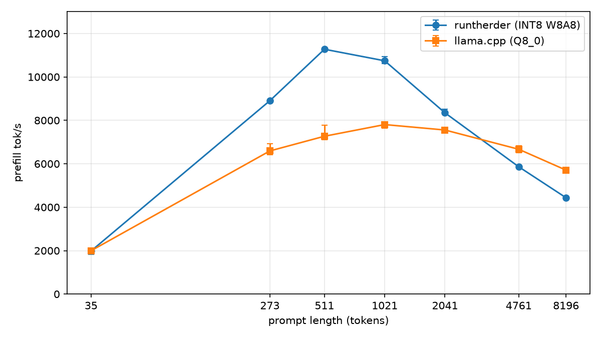
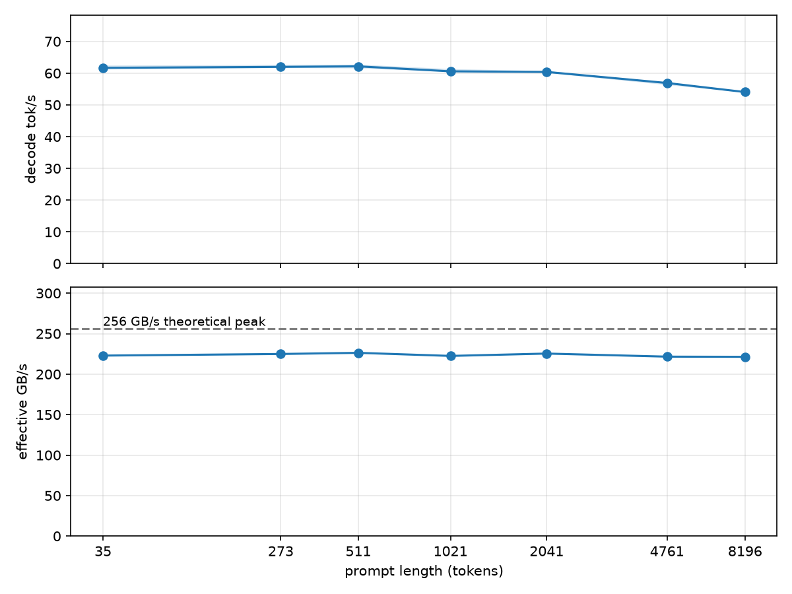

# Runtherder

An LLM inference engine for consumer hardware. Written in C++20 and CUDA with no
inference framework underneath.

It loads a Hugging Face checkpoint, runs it on a single GPU, and is measured against
llama.cpp.

## Features

- Runs Llama 3 and Qwen 3 checkpoints straight from safetensors, single file or sharded.
- Runs BF16, INT8 quantized, and mixed checkpoints. INT8 quantizes weights and
  activations both.
- FP8 KV cache, half the size of BF16.
- Custom CUDA kernels for attention, RMSNorm, RoPE, SwiGLU, and quantization.
  cuBLASLt does the GEMMs.
- Flash attention on both the prefill and the decode path.
- RoPE frequency scaling for long context checkpoints.
- CUDA graphs on the decode path.
- Sampling runs on the GPU: greedy, top k, top p. Defaults come from the
  checkpoint's generation_config.json.
- Interactive chat that applies the checkpoint's own Jinja chat template.
- Streaming output, and a server mode that keeps the model loaded.

## Performance

- **GPU**: NVIDIA RTX 4070 Laptop, 8 GB
- **OS**: Windows 11, WSL2, Ubuntu 22.04
- **CUDA**: 13.2
- **Model**: Llama-3.2-3B-Instruct, INT8 W8A8 with a BF16 output head
- **Compared against**: llama.cpp, same model at Q8_0
- **Generation**: 128 tokens per run, greedy
- **Method**: stock clocks, medians, Release build, warmed up





Prefill, one row per prompt length:

| prompt tokens | prefill tok/s | llama.cpp | ratio | time to first token |
|---|---|---|---|---|
| 35 | 1984 | 1996 | 0.99x | 0.018 s |
| 273 | 8905 | 6592 | 1.35x | 0.031 s |
| 511 | 11274 | 7268 | 1.55x | 0.045 s |
| 1021 | 10742 | 7805 | 1.38x | 0.095 s |
| 2041 | 8345 | 7555 | 1.10x | 0.245 s |
| 4761 | 5863 | 6668 | 0.88x | 0.812 s |
| 8196 | 4438 | 5709 | 0.78x | 1.847 s |

Decode, at matched context depth:

| context depth | decode tok/s | llama.cpp | ratio | effective bandwidth |
|---|---|---|---|---|
| 35 | 61.67 | 68.25 | 0.90x | 222.9 GB/s (87.1%) |
| 511 | 62.14 | 66.68 | 0.93x | 226.3 GB/s (88.4%) |
| 2041 | 60.38 | 64.05 | 0.94x | 225.4 GB/s (88.0%) |
| 8196 | 54.04 | 54.66 | 0.99x | 221.4 GB/s (86.5%) |

Decode is bound by memory bandwidth and sustains a near constant fraction of the card's peak as
context grows. Peak is 256.0 GB/s (8001 MHz x 2 x 128 bit / 8).

Prefill leads on short and mid length prompts and trails on long ones, where attention cost
grows with the square of the prompt length.

### Quantization

The same checkpoint at BF16 and at INT8 W8A8.

| prompt tokens | prefill speedup | decode speedup |
|---|---|---|
| 35 | 1.55x | 1.58x |
| 273 | 1.81x | 1.55x |
| 511 | 1.72x | 1.56x |
| 1021 | 1.81x | 1.57x |
| 2041 | 1.70x | 1.55x |
| 4761 | 1.45x | 1.55x |

The INT8 checkpoint keeps a BF16 output head, 21.9 percent of its per token traffic.


### Memory

Peak usage at 8192 context is 5039 MiB of the 8188 available:

| | |
|---|---|
| Weights | 3441 MiB |
| KV cache at 8192 tokens | 462 MiB |
| CUDA context, activations, scratch | 1136 MiB |

The KV cache is FP8 rather than BF16, which halves its size. Scratch is carved once at load and
scales with the longest prompt accepted. Weights are used as published by the checkpoint author
and are not quantized here. A checkpoint with tied embeddings ships the output head and the
embedding table as separate copies of the same values, so only one is uploaded.

## Build

Needs CUDA 13, CMake 3.24, and a C++20 compiler.

```
cmake -B build -DCMAKE_BUILD_TYPE=Release
cmake --build build -j
```

Builds for Ada (compute 89) by default. Override with `-DRUNTHERDER_CUDA_ARCH=<arch>`.

## Run

`<model>` is a directory holding a Hugging Face checkpoint.

```
./build/runtherder <model> "What is a KV cache?"   one shot
./build/runtherder <model> -cnv                    interactive chat
```

For example:

```
./build/runtherder ./models/Llama-3.2-3B-Instruct-quantized.w8a8 -cnv
```

```
-cnv, --conversation   interactive chat, applies the checkpoint's chat template
--system TEXT          system prompt, conversation mode only
--prompt-file FILE     read the prompt from a file
--max-tokens N         new tokens to generate
--temperature F        0 is greedy
--top-p F, --top-k N   sampling cutoffs
--stream               emit token ids, one per line
--serve                keep the model loaded, read prompts from stdin
--enforce-eager        disable CUDA graphs
```

Tests: `ctest --test-dir build`.

Benchmarks: `uv run scripts/bench_sweep.py --runs 15`.

## Scope

Single stream on one consumer GPU, for local use on a single machine. Llama 3 and Qwen 3
are the architectures supported today. Further weight quantization (INT4), KV cache paging
(paged attention), a scheduler with continuous batching, and additional architectures are
planned.

## References

- [llama.cpp](https://github.com/ggml-org/llama.cpp)
- [andrewkchan/yalm](https://github.com/andrewkchan/yalm)
- [GeeeekExplorer/nano-vllm](https://github.com/GeeeekExplorer/nano-vllm)
- [vLLM](https://github.com/vllm-project/vllm)
- [FlashAttention-2](https://arxiv.org/abs/2307.08691)
- [Flash Attention from Scratch](https://lubits.ch/flash)
- [How to Optimize a CUDA Matmul Kernel](https://siboehm.com/articles/22/CUDA-MMM)
